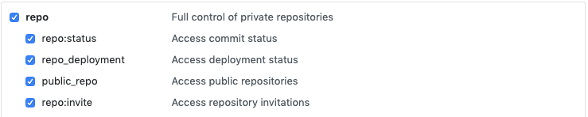
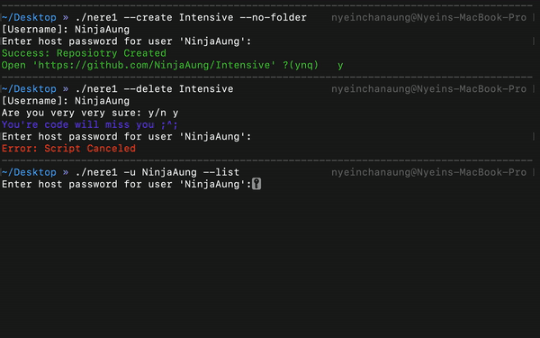

<h1 align="center">Nere - New Repository</h1>
<p>
  <a href="https://github.com/NinjaAung/nere#readme" target="_blank">
    
  </a>
  <a href="https://github.com/NinjaAung/nere/graphs/commit-activity" target="_blank">
    
  </a>
  <a href="https://github.com/NinjaAung/nere/blob/master/LICENSE" target="_blank">
    
  </a>
  <a href="https://twitter.com/Ninjer27" target="_blank">
    
  </a>
</p>

> Command line tool use to update, create and delete repositories

## Pre-req
Before installing please use use [Github OAuth Tokens](https://github.com/settings/tokens). Enable **Repo** and  **delete_repo** scopes




## Install

```sh
brew tap ninjaaung/nere
brew install nere
```

## Usage 

```sh
nere [-h help] [-u username] [-p personalToken] [-r reponame] [-d description]
```
## Key Features
### Creating

### Deleting



## Author

👤 **Nyein Chan Aung**

* Twitter: [@Ninjer27](https://twitter.com/Ninjer27)
* Github: [@NinjaAung](https://github.com/NinjaAung)
* LinkedIn: [@NinjaAung](https://linkedin.com/in/NinjaAung)

## 🤝 Contributing

Contributions, issues and feature requests are welcome!<br />Feel free to check [issues page](https://github.com/NinjaAung/nere/issues). You can also take a look at the [contributing guide](https://github.com/NinjaAung/nere/blob/master/CONTRIBUTING.md).

## Show your support

Give a ⭐️ if this project helped you!

## 📝 License

Copyright © 2020 [Nyein Chan Aung](https://github.com/NinjaAung).<br />
This project is [MIT](https://github.com/NinjaAung/nere/blob/master/LICENSE) licensed.
