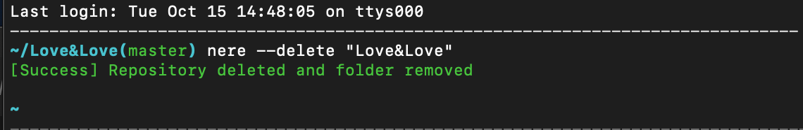

# Git-New-Repository-Shell
Shell command that enables a user to create new git repository in the command line | | Terminal

# NERE -- New Repository Shell Command
Using github api create new repositories  straight from the shell using nere 


## Synopsis
nere [-h help] [-u username] [-p personalToken] [-r reponame] [-d description]

## Description
the nere utility creates a repository on the github user (https://github.com) and remote connect to it via the terminal instantly

    A list of options as follows:

    -h )            will print the help document for the command
    -u )            takes username input from the user
    -a )            private token from user's github
    -r )            takes and creates the input from the user
    --delete )
    --description ) takes and create the description for the repository
    -p )            makes the repo private 

## Key Feature
### Creating Repositories From terminal

### Deleting Repositories



## Usage

1. Change the file mode to a executible:
    ```
    ~ chmod 755 nere.sh
    ```
2. Excute with parameter
    ```
    ~ ./nere.sh help
    ```

## Implementing into your path
1. Move to the Home directory
    ```
    cd ~
    ```
2. Create a bin Folder and place the shell file in
    ```
    mkdir bin
    ~/bin/nere.sh
    ```
3. In your .bash_profile or create one with ```touch .bash_profile``` and add the file to the path
    ```
    cd ~/.bash_profile
    vi .bash_profile
    ```
    or
    ```
    echo "PATH=$PATH:$HOME/bin" >> .bash_profile
    ```
# Future Version
v2.0 will feature a global list, instead of constantly typing in default information


# Information and Documentation 
[Github API v3](https://developer.github.com/v3/)